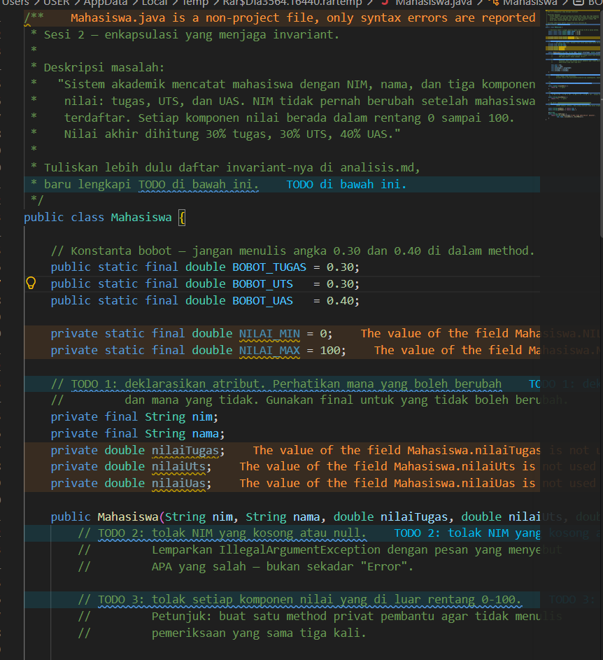
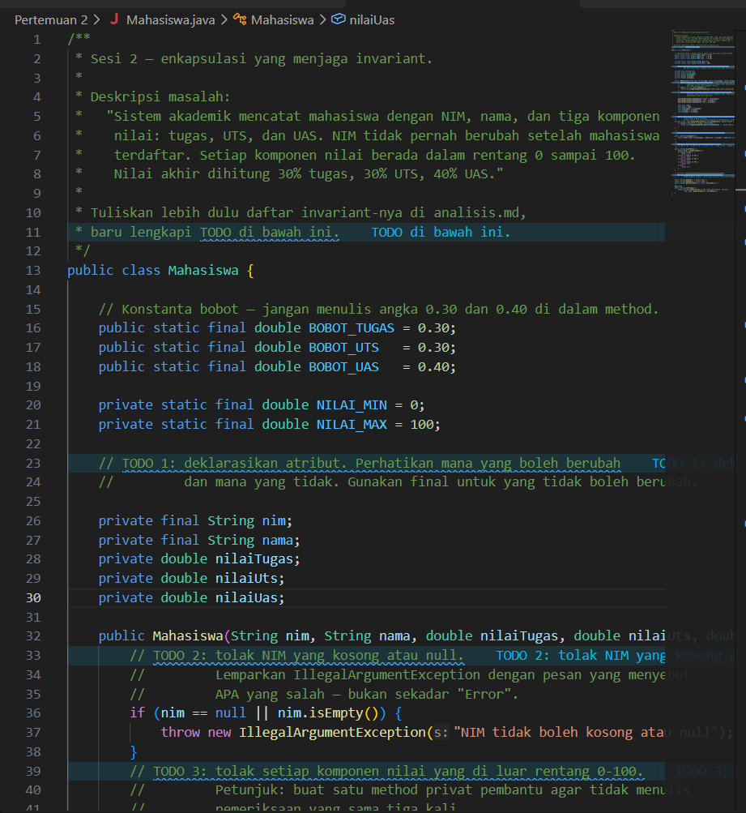
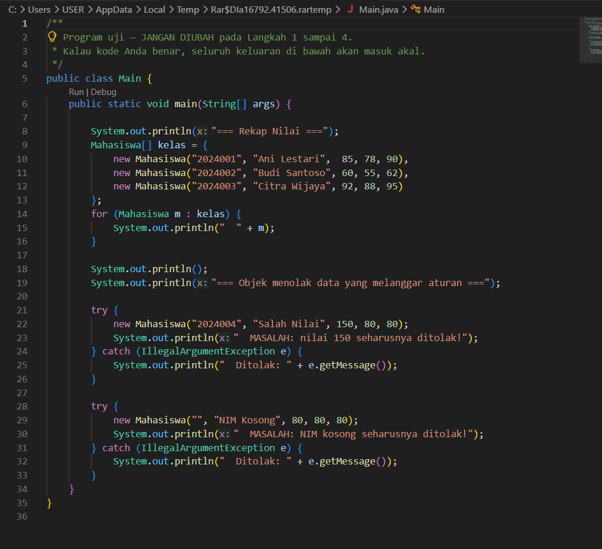
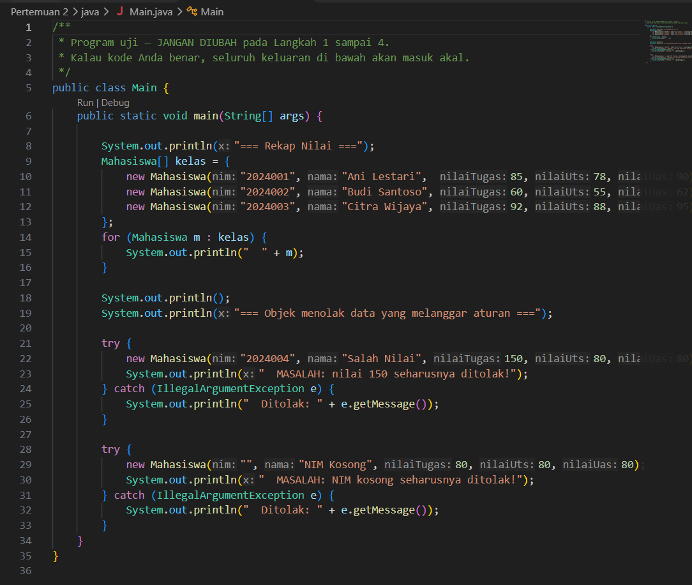
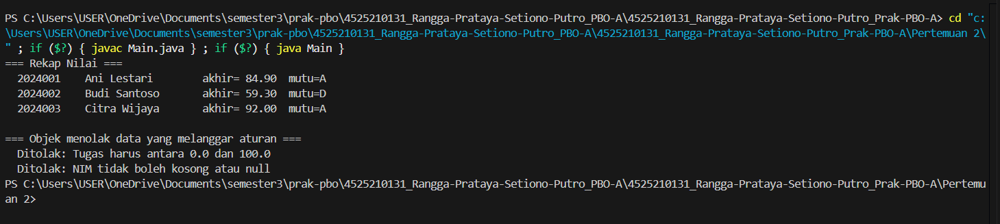
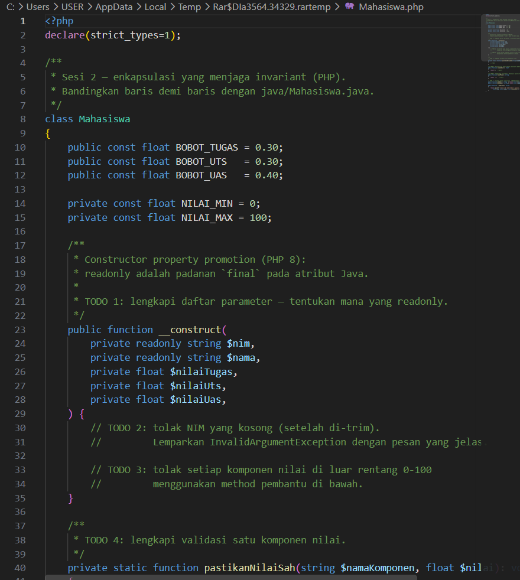
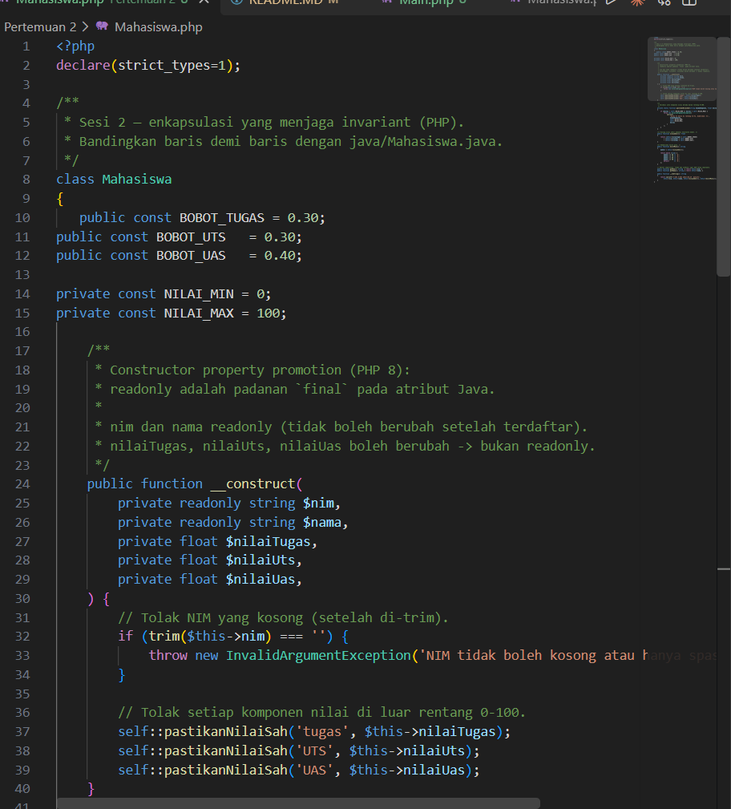
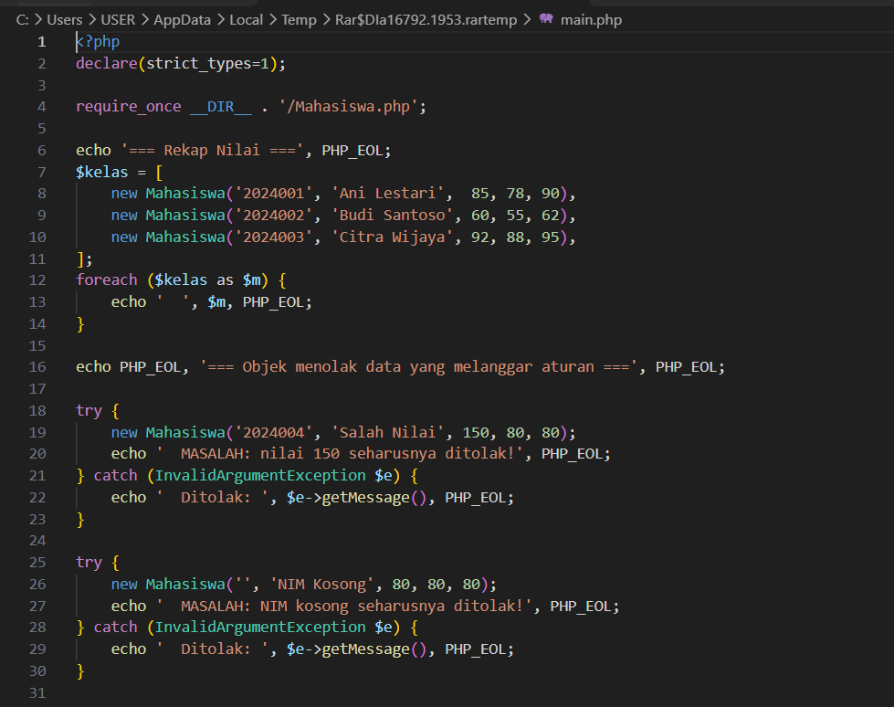
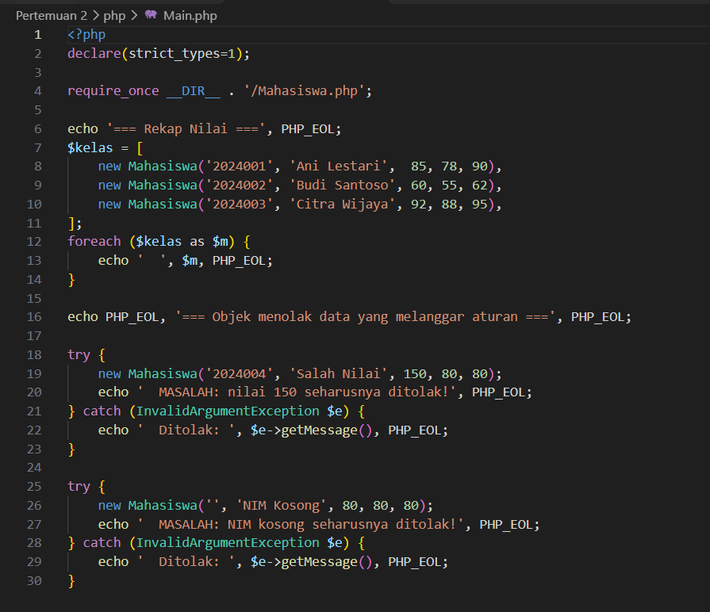
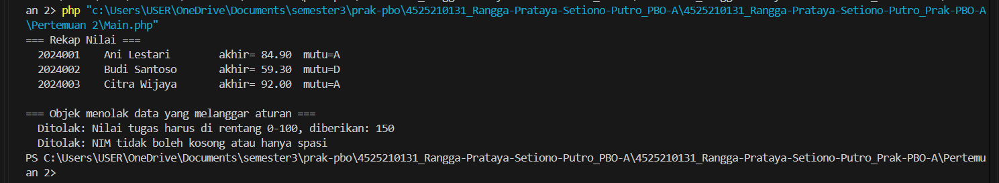

# LAPORAN PRAKTIKUM PEMROGRAMAN BERBASIS OBJEK

| Informasi Praktikan | Keterangan |
| :--- | :--- |
| **Nama** |  Rangga Prataya Setiono Putro |
| **NPM** | 4525210131 |
| **Kelas** | A |
| **Mata Kuliah** | Pemrograman Berbasis Objek (PBO) |
| **Pertemuan** | [Pertemuan 2] 
| **Tanggal** | 10 September 2026 | 
| **Dosen Pengampu** | Adi Wahyu Pribadi, S.Si., M.Kom |

---

## 1. Implementasi Java
**Penjelasan Kode:**
> PRangkaian kode Java di atas mengimplementasikan konsep dasar Pemrograman Berorientasi Objek (OOP) yang berfokus pada enkapsulasi ketat dan penjagaan invariant data akademik mahasiswa. Kelas Mahasiswa mendefinisikan atribut imutabel untuk identitas seperti NIM (final) guna mencegah perubahan setelah objek terdaftar, serta menerapkan konstanta khusus untuk pembatasan rentang nilai valid (0 hingga 100) dan bobot penilaian akhir tanpa menggunakan angka magis (magic numbers) di dalam logika perhitungan. Melalui penerapan method validasi privat pembantu serta penanganan ekseksi (IllegalArgumentException), kelas ini memastikan bahwa setiap upaya instansiasi dengan data yang melanggar aturan—seperti nilai di luar batas atau NIM kosong—akan ditolak secara langsung. Selain itu, program uji (Main) mendemonstrasikan bagaimana rekapitulasi nilai akhir, penentuan huruf mutu, dan pencetakan data mahasiswa dapat dikoordinasikan secara terstruktur dan aman dari manipulasi data tidak sah.

### 1.1. File: `Mahasiswa.java`

**Bukti Eksekusi (Screenshot):**
* **Before** *(Kondisi awal / Kesalahan kompilasi)*:

* **After** *(Kondisi akhir / Eksekusi berhasil)*:

### 1.2. File: `Main.java`

**Bukti Eksekusi (Screenshot):**
* **Before** *(Kondisi awal / Kesalahan kompilasi)*:

* **After** *(Kondisi akhir / Eksekusi berhasil)*:

### Output
**Output Program:**

## 2. Implementasi PHP
**Penjelasan Kode:**
> Implementasi kode PHP di atas menerapkan prinsip Pemrograman Berorientasi Objek (OOP) yang berfokus pada enkapsulasi ketat dan perlindungan *invariant* data akademik mahasiswa, yang dirancang serupa dengan versi Java-nya. Kelas `Mahasiswa` memanfaatkan fitur modern PHP seperti *constructor property promotion* dan properti *readonly* untuk memastikan atribut identitas seperti NIM dan nama bersifat imutabel serta tidak dapat diubah setelah objek terdaftar. Selain itu, kelas ini menggunakan konstanta khusus untuk bobot penilaian akhir dan batas nilai valid, serta dilengkapi dengan mekanisme validasi konstruktor dan method privat pembantu (`pastikanNilaiSah`) untuk melempar ekseksi `InvalidArgumentException` apabila ditemukan data yang melanggar aturan. Melalui program uji eksekusi (`main.php`), sistem mampu mengelola rekapitulasi nilai akhir secara otomatis, menentukan huruf mutu menggunakan struktur *match* ekspresif, serta secara proaktif menolak instansiasi objek dengan data tidak sah seperti NIM kosong atau nilai di luar rentang 0 hingga 100.
### 2.1. File: `Mahasiswa.php`

**Bukti Eksekusi (Screenshot):**
* **Before** *(Kondisi awal / Kesalahan kompilasi)*:

* **After** *(Kondisi akhir / Eksekusi berhasil)*:

### 2.1. File: `Main.php`

**Bukti Eksekusi (Screenshot):**
* **Before** *(Kondisi awal / Kesalahan kompilasi)*:

* **After** *(Kondisi akhir / Eksekusi berhasil)*:

### Output
**Output Program:**

---

## 3. Kesimpulan
> Kesimpulan dari perbandingan kedua kode kelas `Mahasiswa` dalam bahasa Java dan PHP ini adalah bahwa keduanya menerapkan prinsip *object-oriented programming* (OOP) yang sama kuatnya dalam hal enkapsulasi dan perlindungan *invariant*, meskipun menggunakan fitur sintaksis yang berbeda sesuai karakteristik masing-masing bahasa. Pada versi Java, keamanan data dijaga menggunakan modifier `final` untuk atribut identitas seperti NIM dan nama, sementara versi PHP memanfaatkan fitur modern PHP 8 berupa *constructor property promotion* dan kata kunci `readonly` untuk mencapai fungsi kekebalan data yang serupa. Kedua bahasa ini sama-sama menerapkan validasi ketat pada konstruktor—didukung oleh method pembantu privat—untuk menolak NIM kosong serta memastikan komponen nilai selalu berada pada rentang yang sah (0–100). Dengan demikian, baik implementasi Java maupun PHP berhasil mewujudkan sistem akademik yang andal, konsisten, dan aman dari manipulasi data yang tidak valid.