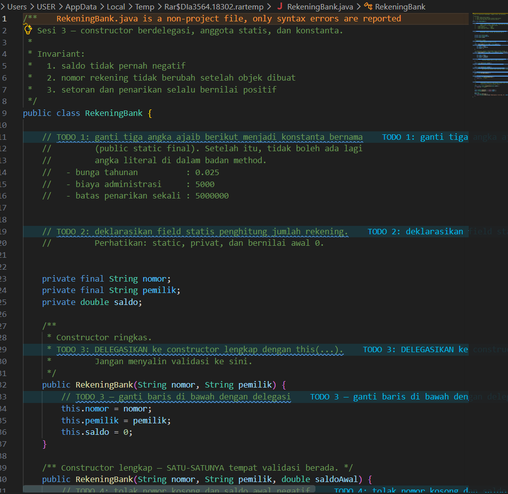
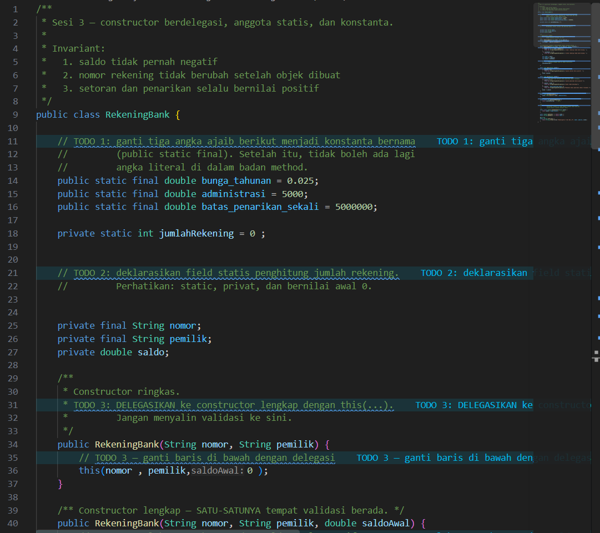
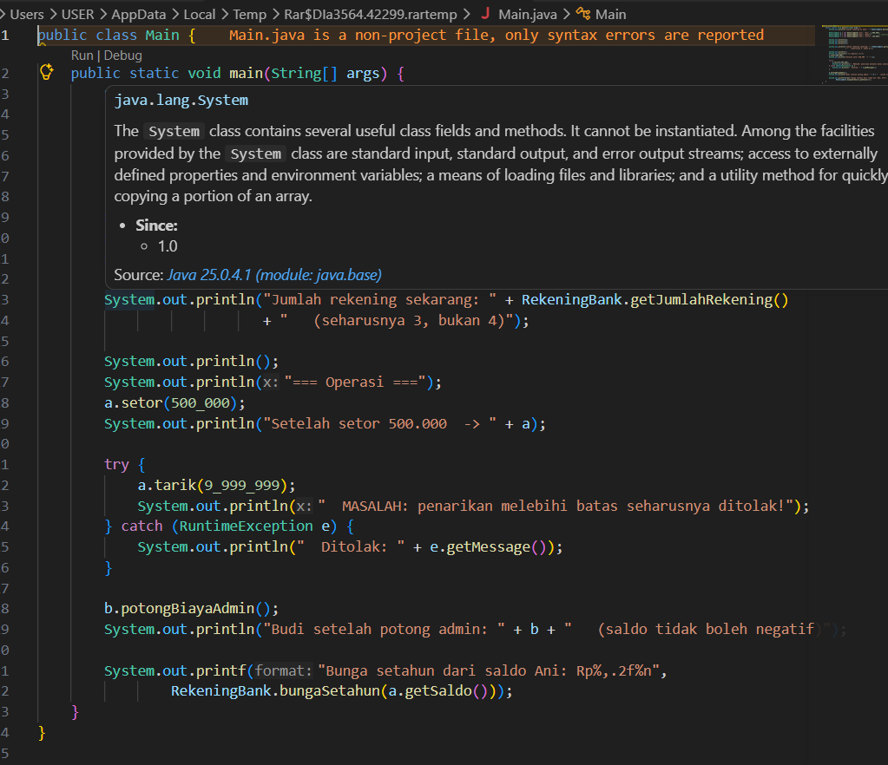
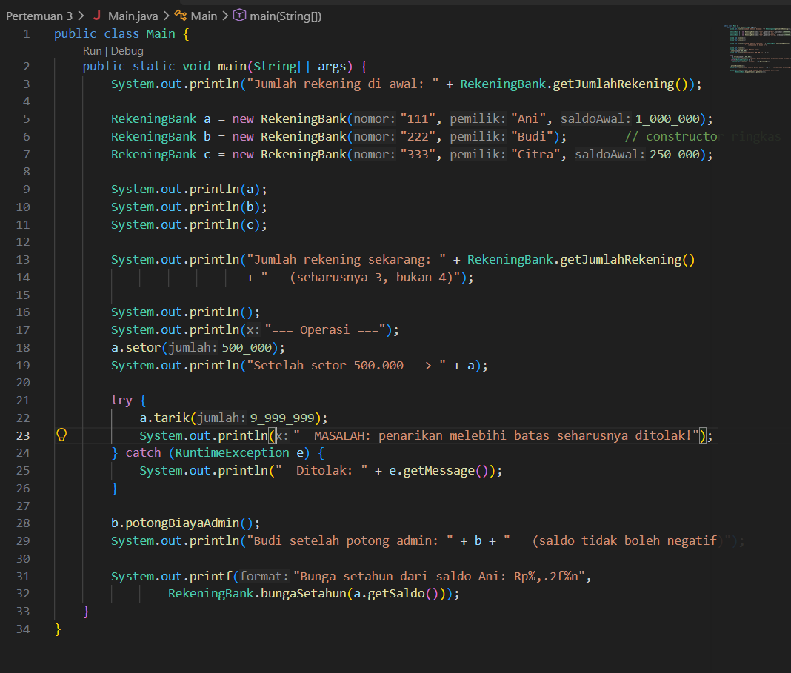
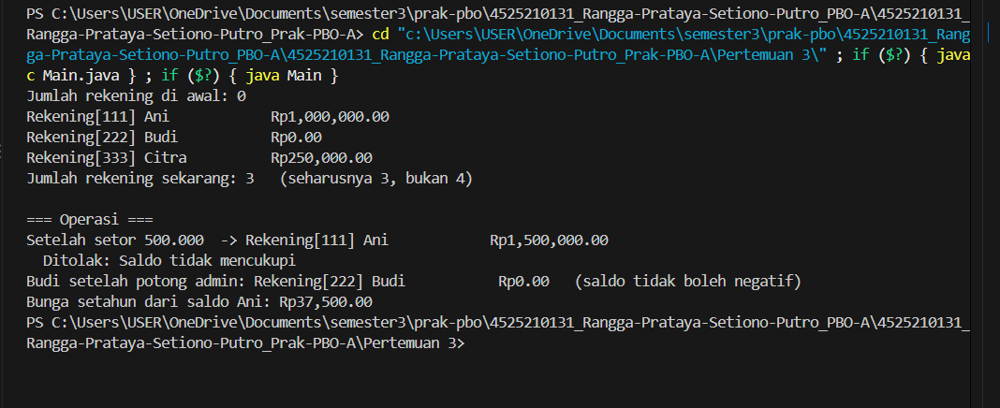
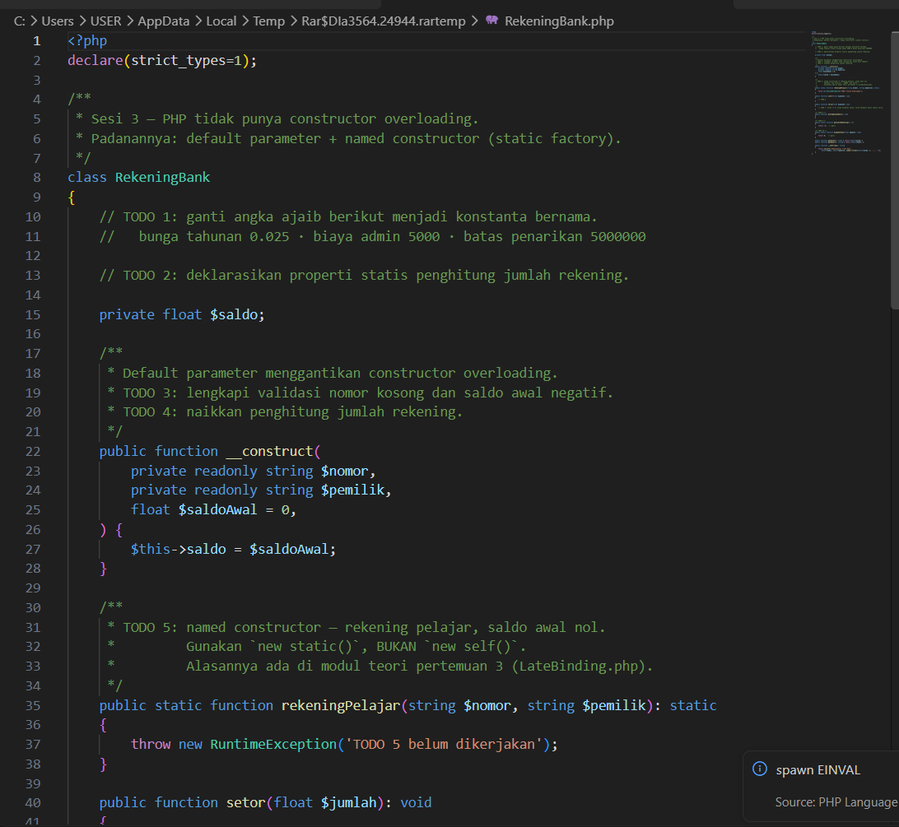
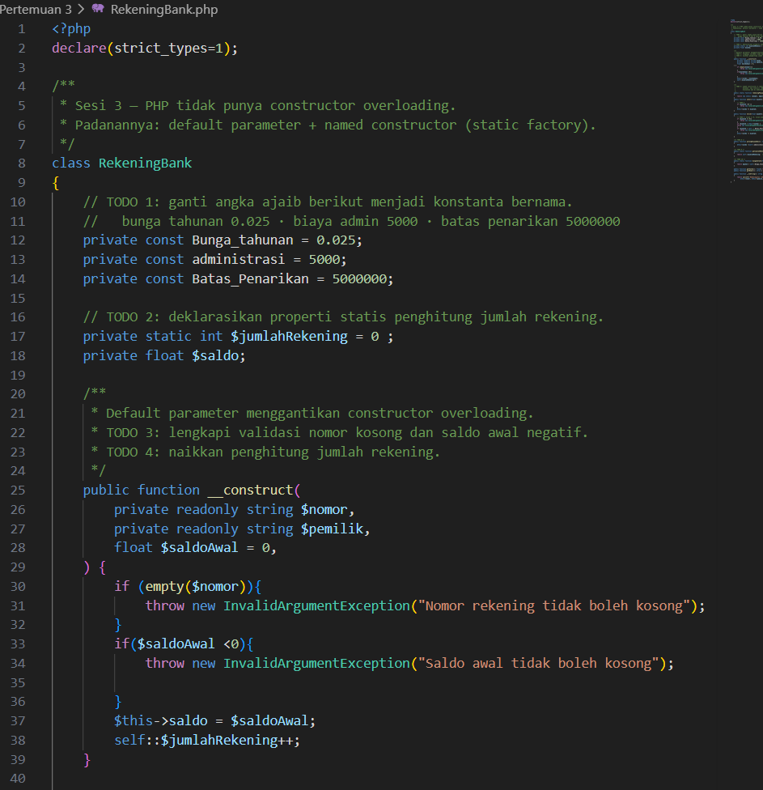
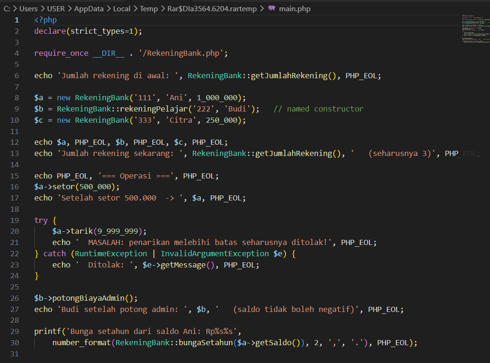
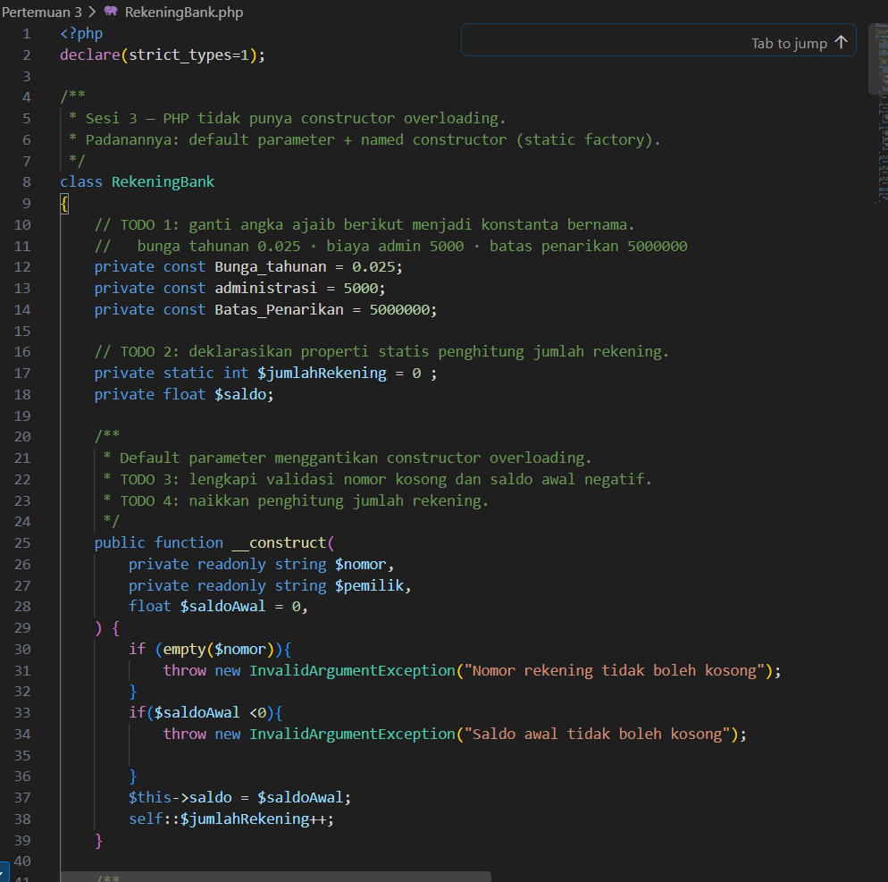
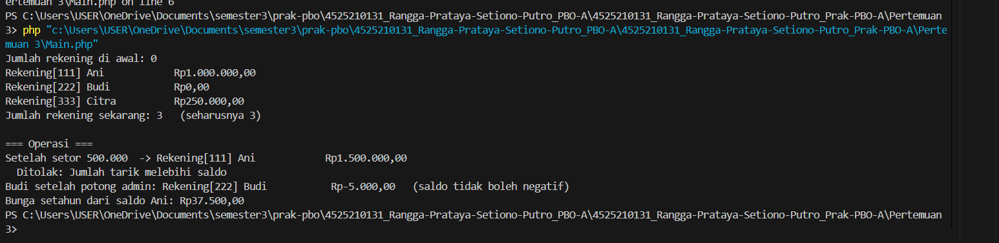

# LAPORAN PRAKTIKUM PEMROGRAMAN BERBASIS OBJEK

| Informasi Praktikan | Keterangan |
| :--- | :--- |
| **Nama** | Rangga Prataya Setiono Putro |
| **NPM** | 4525210131 |
| **Kelas** | A |
| **Mata Kuliah** | Pemrograman Berbasis Objek (PBO) |
| **Pertemuan** | Pertemuan 3 |
| **Tanggal** | 17 September 2026 |
| **Dosen Pengampu** | Adi Wahyu Pribadi, S.Si., M.Kom |

---

## 1. Implementasi Java

**Penjelasan Kode:**
> Kelas RekeningBank dirancang untuk menerapkan prinsip pemrograman berorientasi objek yang berfokus pada enkapsulasi ketat, delegasi konstruktor, serta pengelolaan anggota statis untuk menjaga integritas sistem keuangan. Kelas ini mendefinisikan konstanta global untuk aturan bisnis seperti suku bunga, biaya administrasi, dan batas penarikan, serta menggunakan atribut final pada nomor rekening guna memastikan identitasnya tidak pernah berubah setelah objek dibuat. Perlindungan invariant ditegakkan melalui konstruktor utama—di mana konstruktor ringkas mendelegasikan prosesnya menggunakan this(...)—untuk menolak nomor kosong, mencegah saldo awal negatif, serta memastikan penambahan penghitung jumlah rekening (jumlahRekening) hanya terjadi di satu tempat terpusat. Selain itu, kelas ini menyediakan method validasi transaksi untuk setoran dan penarikan, pemotongan biaya administrasi yang aman dari saldo negatif, serta pemanfaatan method statis utilitas untuk perhitungan bunga tanpa bergantung pada status instans tertentu.

### 1.1. File: `Satu.java`

**Bukti Eksekusi (Screenshot):**
* **Before** *(Kondisi awal / Kesalahan kompilasi)*:

* **After** *(Kondisi akhir / Eksekusi berhasil)*:

### 1.3. File: `Main.java`

**Bukti Eksekusi (Screenshot):**
* **Before** *(Kondisi awal / Kesalahan kompilasi)*:

* **After** *(Kondisi akhir / Eksekusi berhasil)*:

### Output
**Output Program:**

---

## 2. Implementasi PHP

**Penjelasan Kode:**
> Kelas RekeningBank mengimplementasikan sistem manajemen rekening keuangan berbasis Java yang menerapkan enkapsulasi ketat serta perlindungan invariant secara konsisten. Program ini memanfaatkan konstanta global bertipe public static final untuk menetapkan aturan bisnis seperti suku bunga tahunan, biaya administrasi, dan batas maksimal penarikan sekali transaksi, serta menggunakan kata kunci final pada atribut nomor rekening guna memastikan identitasnya tidak berubah setelah objek berhasil diinisialisasi. Mekanisme delegasi konstruktor melalui ekspresi this(...) diterapkan untuk memusatkan seluruh validasi data pada konstruktor utama—seperti menolak nomor kosong atau saldo awal negatif—sekaligus memastikan penghitungan global jumlahRekening bertambah secara akurat di satu tempat terpusat. Selain itu, kelas ini menyediakan method fungsional untuk menangani transaksi setoran dan penarikan yang tervalidasi positif, pemotongan biaya administrasi yang dijamin aman dari kondisi saldo negatif, serta method utilitas statis untuk menghitung proyeksi bunga tahunan secara mandiri tanpa bergantung pada status instans tertentu.

### 2.1. File: `RekeningBank.php`

**Bukti Eksekusi (Screenshot):**
* **Before** *(Kondisi awal / Galat logika)*:

* **After** *(Kondisi akhir / Eksekusi berhasil)*:

### 2.3. File: `main.php`

**Bukti Eksekusi (Screenshot):**
* **Before** *(Kondisi awal / Galat logika)*:

* **After** *(Kondisi akhir / Eksekusi berhasil)*:

### Output
**Output Program:**

---

## 3. Kesimpulan
> Kesimpulan dari program RekeningBank dan main yang telah dibahas adalah bahwa implementasi tersebut berhasil menerapkan prinsip Pemrograman Berorientasi Objek (OOP) tingkat lanjut melalui enkapsulasi ketat, perlindungan invariant finansial, serta pemanfaatan konstanta dan anggota statis secara optimal. Program ini memastikan integritas data tetap terjaga dengan menetapkan nomor rekening yang imutabel (final), memusatkan seluruh validasi aturan bisnis pada konstruktor utama melalui mekanisme delegasi this(...), serta mengelola penghitungan instans global menggunakan variabel statis. Selain itu, adanya validasi transaksi yang ketat pada proses setoran dan penarikan, keamanan saldo dari pemotongan biaya administrasi, serta penyediaan method utilitas statis untuk perhitungan bunga menjadikan sistem keuangan sederhana ini sangat terstruktur, aman dari manipulasi data tidak valid, dan efisien.