# LAPORAN PRAKTIKUM PEMROGRAMAN BERBASIS OBJEK

| Informasi Praktikan | Keterangan |
| :--- | :--- |
| **Nama** |  Rangga Prataya Setiono Putro |
| **NPM** |  4525210131 |
| **Kelas** | A |
| **Mata Kuliah** | Pemrograman Berbasis Objek (PBO) |
| **Pertemuan** | [Pertemuan 4 |
| **Tanggal** | [24 September 2026] |

---

## 1. Implementasi Java

**Penjelasan Kode:**
> Struktur kelas berbasis pewarisan (inheritance) ini dirancang untuk merepresentasikan hierarki objek dengan memanfaatkan kelas abstrak sebagai fondasi bersama. Kelas induk mendefinisikan atribut universal yang imutabel serta perilaku dasar—seperti validasi agar data pokok tidak bernilai negatif dan implementasi method abstrak untuk mengidentifikasi jenis entitas—sementara kelas-kelas turunannya memperluas fungsionalitas tersebut melalui spesialisasi atribut tambahan, delegasi konstruktor via super, serta modifikasi logika kalkulasi (method overriding) sesuai karakteristik masing-masing sub-entitas tanpa mengubah struktur inti di atasnya.

### 1.1. File: `Pegawai.java`

**Bukti Eksekusi (Screenshot):**
* **Before** *(Kondisi awal / Kesalahan kompilasi)*:
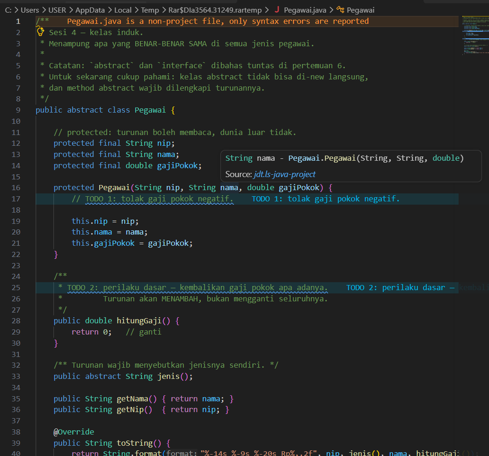

* **After** *(Kondisi akhir / Eksekusi berhasil)*:
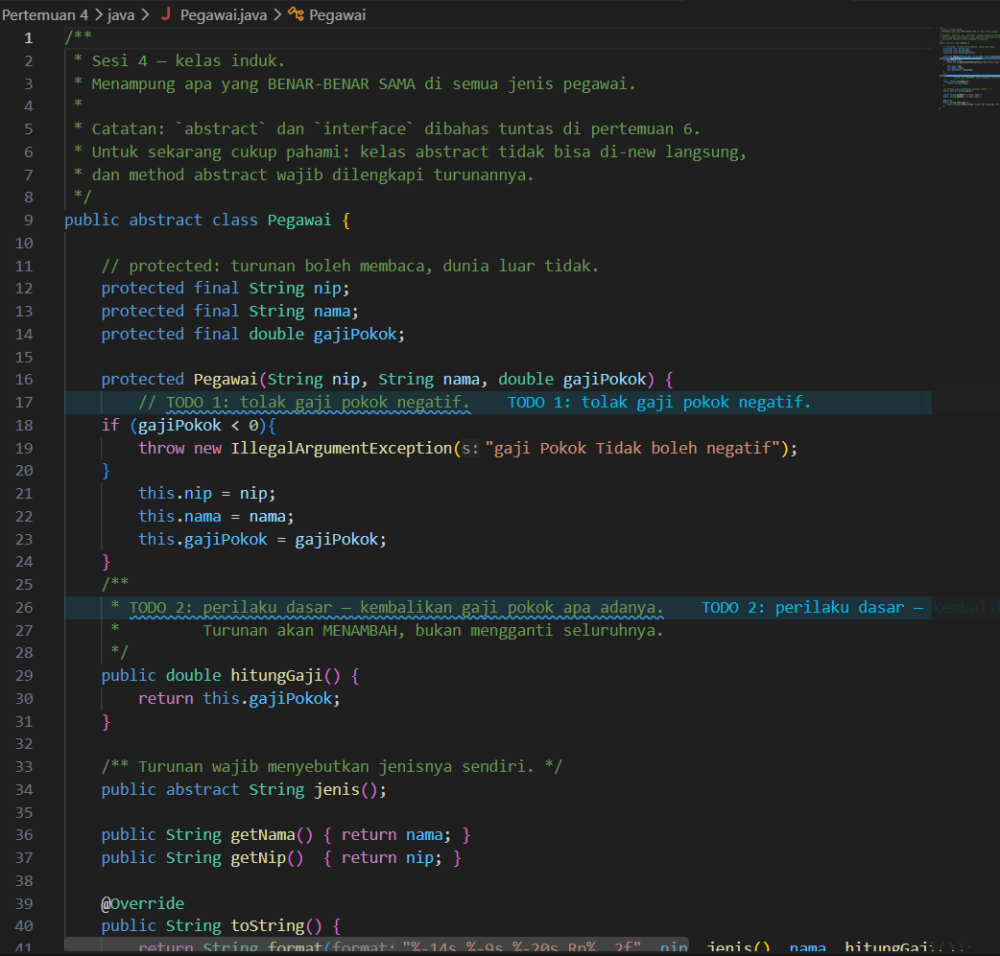

### 1.2. File: `Pegawaikontrak.java`

**Bukti Eksekusi (Screenshot):**
* **Before** *(Kondisi awal / Kesalahan kompilasi)*:
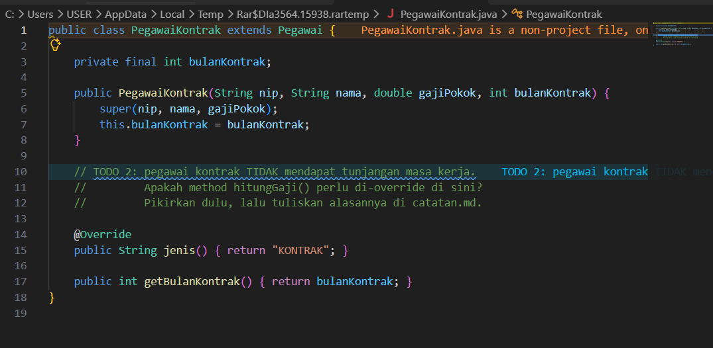

* **After** *(Kondisi akhir / Eksekusi berhasil)*:

## 1.3. File: `PegawaiTetap.java`

**Bukti Eksekusi (Screenshot):**
* **Before** *(Kondisi awal / Kesalahan kompilasi)*:
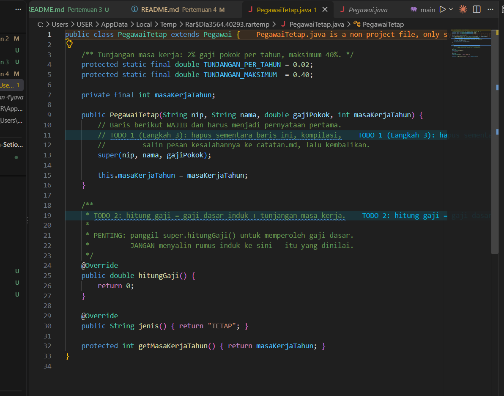

**Bukti Eksekusi (Screenshot):**
* **After** *(Kondisi awal / Kesalahan kompilasi)*:

### 1.4. File: `Main.java`

**Bukti Eksekusi (Screenshot):**
* **Before** *(Kondisi awal / Kesalahan kompilasi)*:
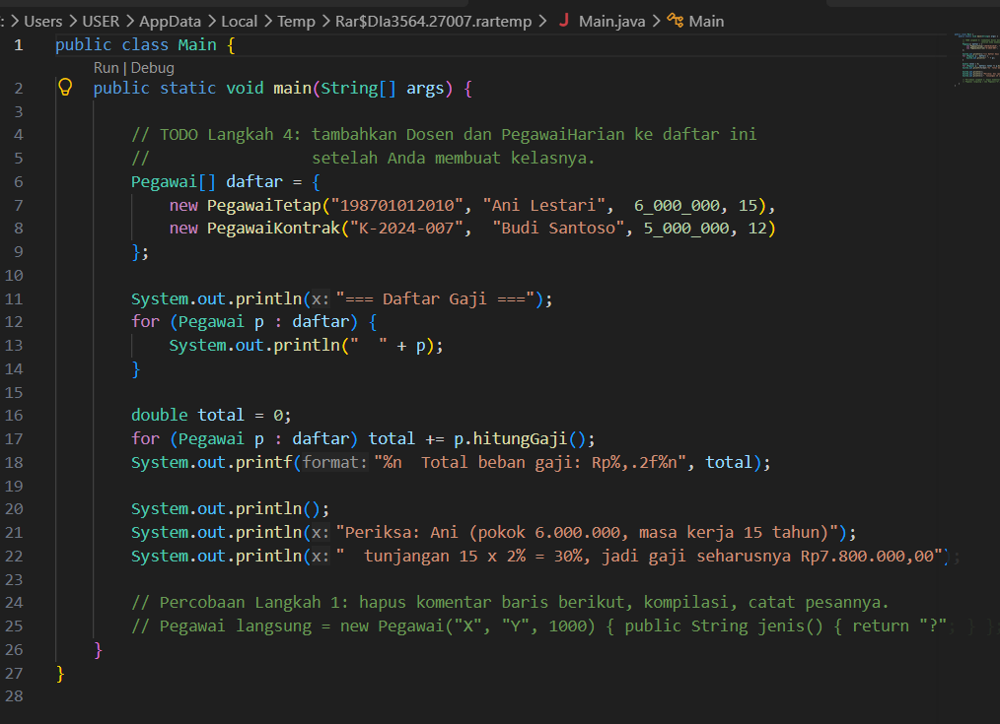

**Bukti Eksekusi (Screenshot):**
* **After** *(Kondisi akhir / Eksekusi berhasil)*:

# 1.5. File: `PegawaiHarian.java`
**Penjelasan Kode:**
>Penambahan kelas `PegawaiHarian` dalam hierarki pewarisan ini bertujuan untuk mengakomodasi model perhitungan kompensasi yang berbeda dari pegawai tetap atau kontrak, di mana upah dihitung berdasarkan akumulasi satuan waktu kerja (seperti jumlah hari masuk) dikalikan dengan tarif dasar harian. Dengan memanfaatkan kelas abstrak induk, `PegawaiHarian` dapat menggunakan kembali atribut universal yang sudah ada sekaligus menerapkan spesialisasi kalkulasi gajinya sendiri melalui mekanisme *method overriding* tanpa harus mengubah struktur dasar sistem secara keseluruhan.

**Bukti Eksekusi (Screenshot):**
* **Penambahan** *(Kondisi awal / Kesalahan kompilasi)*:

# 1.6. File: `dosen.java`
**Penjelasan Kode:**
>Penambahan kelas `Dosen` dalam hierarki pewarisan ini bertujuan untuk merepresentasikan peran pengajar tetap yang memiliki struktur kompensasi khusus, yaitu berupa tambahan tunjangan fungsional di luar gaji pokok dan tunjangan masa kerja yang diperoleh dari kelas induknya (`PegawaiTetap`). Dengan memanfaatkan pewarisan, kelas `Dosen` dapat menggunakan kembali atribut dan logika yang sudah ada sekaligus melakukan spesialisasi perhitungan gaji melalui mekanisme *method overriding* (`hitungGaji()`) dan identifikasi jenis entitas (`jenis()`) tanpa harus menulis ulang kode dasar pegawai secara keseluruhan.

**Bukti Eksekusi (Screenshot):**
* **Penambahan** *(Kondisi awal / Kesalahan kompilasi)*:

### Output
**Output Program:**

---

## 2. Implementasi PHP

**Penjelasan Kode:**
> [Isi Penjelasan.]

### 2.1. File: `Pegawai.php`

**Bukti Eksekusi (Screenshot):**
* **Before** *(Kondisi awal / Galat logika)*:
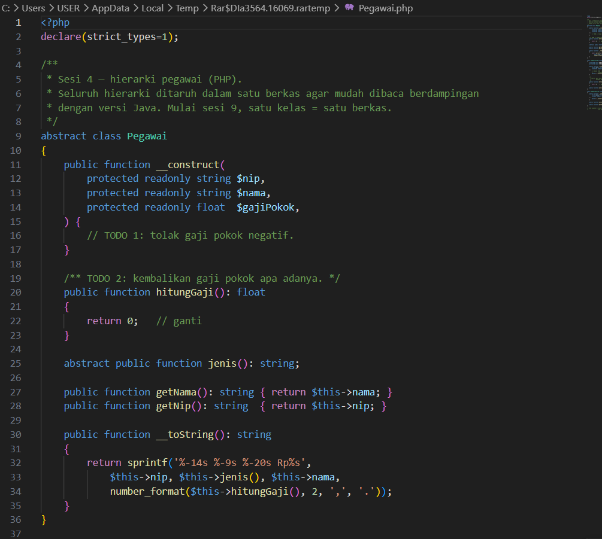
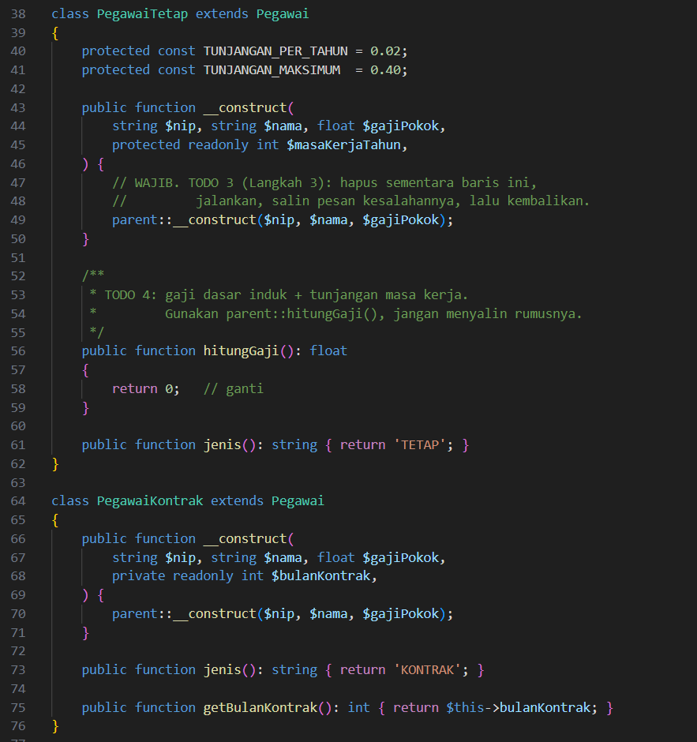

* **After** *(Kondisi akhir / Eksekusi berhasil)*:
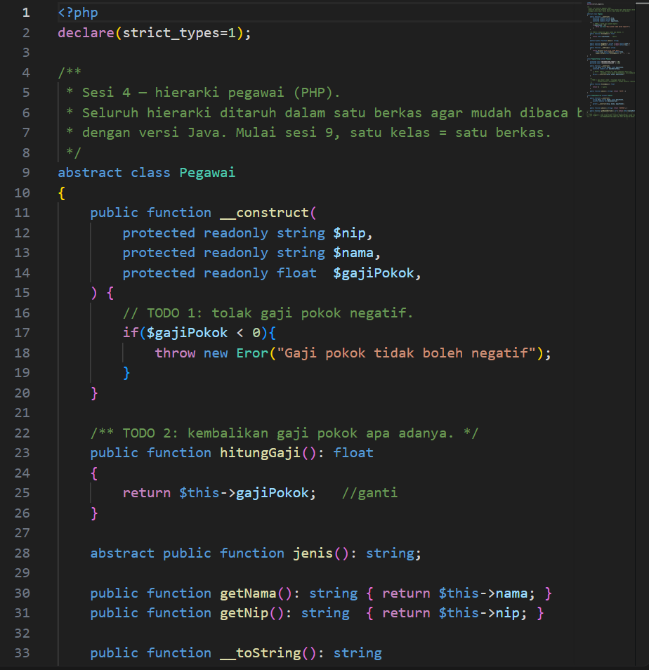
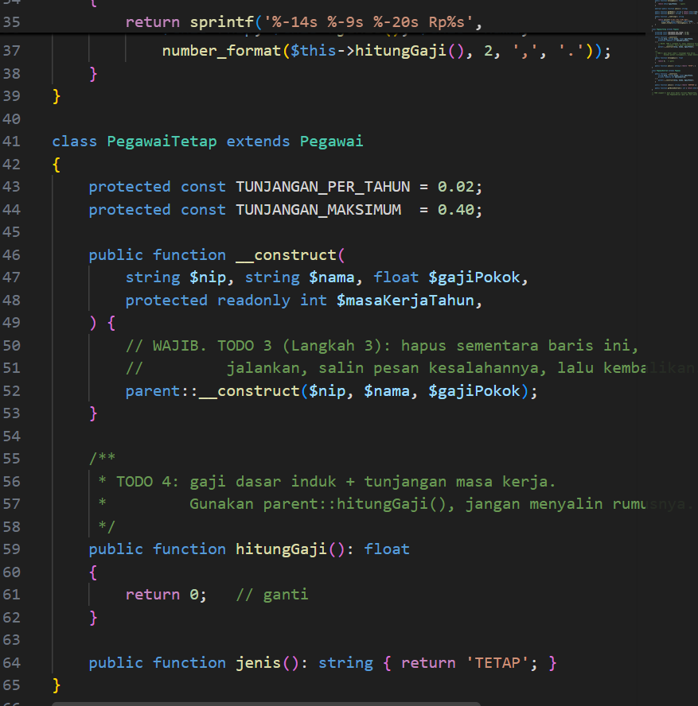
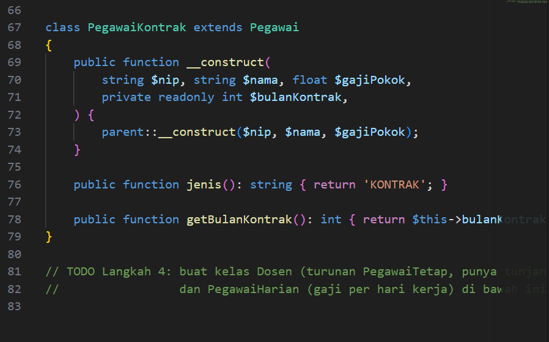

### 2.3. File: `main.php`

**Bukti Eksekusi (Screenshot):**
* **Before** *(Kondisi awal / Galat logika)*:
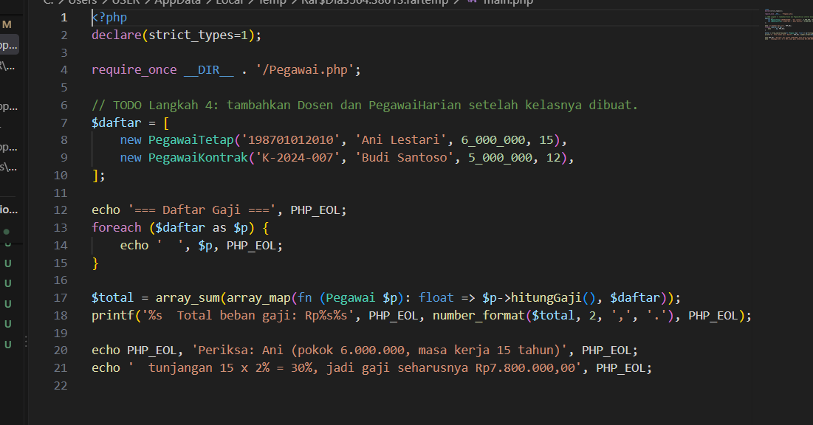

* **After** *(Kondisi akhir / Eksekusi berhasil)*:
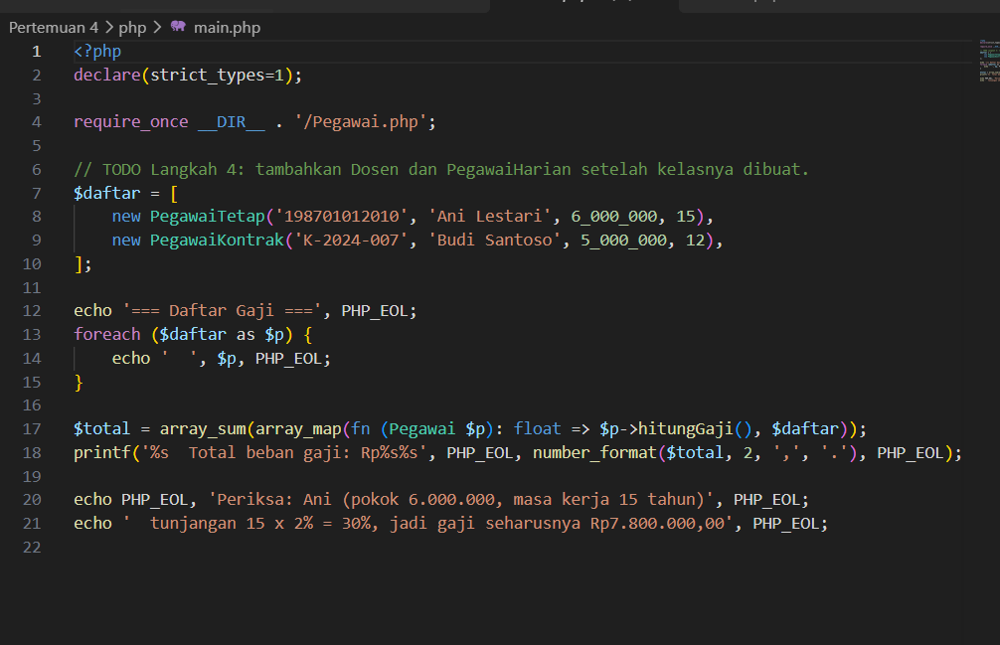

### Output
**Output Program:**
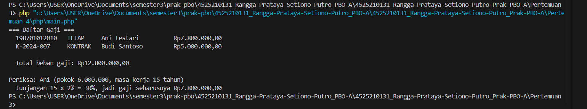

---

## 3. Kesimpulan
> Kesimpulan dari keseluruhan implementasi program berbasis Java dan php pada sesi ini adalah bahwa penerapan pilar Pemrograman Berorientasi Objek (OOP) seperti pewarisan (inheritance) dan polimorfisme berhasil membangun struktur sistem yang fleksibel serta terorganisir dengan baik. Kelas abstrak bertindak sebagai fondasi utama yang menangani atribut universal dan validasi data dasar, sementara berbagai kelas turunan memperluas fungsionalitas tersebut untuk mengakomodasi aturan bisnis dan model perhitungan kompensasi yang spesifik. Melalui mekanisme method overriding dan polimorfisme berbasis array kelas induk, program mampu memproses kumpulan data yang beragam secara seragam dan dinamis tanpa harus mengubah struktur inti yang sudah ditetapkan.