# LAPORAN PRAKTIKUM PEMROGRAMAN BERBASIS OBJEK

| Informasi Praktikan | Keterangan |
| :--- | :--- |
| **Nama** | Rangga Prataya Setiono Putro  |
| **NPM** | 4525210131 |
| **Kelas** | A |
| **Mata Kuliah** | Pemrograman Berbasis Objek (PBO) |
| **Pertemuan** | [Pertemuan 5] |
| **Tanggal** | [01 Oktober 2026] |

---

## 1. Implementasi Java
**Penjelasan Kode:**
> Sekumpulan kelas seperti Persegi, Lingkaran, Segitiga, dan Trapesium dirancang untuk mengimplementasikan konsep pewarisan dan polimorfisme dengan memperluas kelas abstrak induk BangunDatar. Masing-masing kelas menerapkan enkapsulasi ketat dengan atribut yang bersifat immutable (final) serta menyertakan mekanisme validasi pada konstruktor untuk memastikan seluruh parameter ukuran bernilai positif di atas nol. Selain itu, setiap kelas turunan secara spesifik meng-override method luas() dan keliling() menggunakan rumus matematika yang sesuai—seperti penggunaan Rumus Heron untuk segitiga, konstanta Math.PI untuk lingkaran, serta asumsi trapesium sama kaki—sehingga kumpulan bentuk geometri tersebut dapat diproses secara seragam dan dinamis melalui program utama berbasis upcasting.

### 1.1. File: `AntiPattern.java`

**Bukti Eksekusi (Screenshot):**
* **Before** *(Kondisi awal / Kesalahan kompilasi)*:
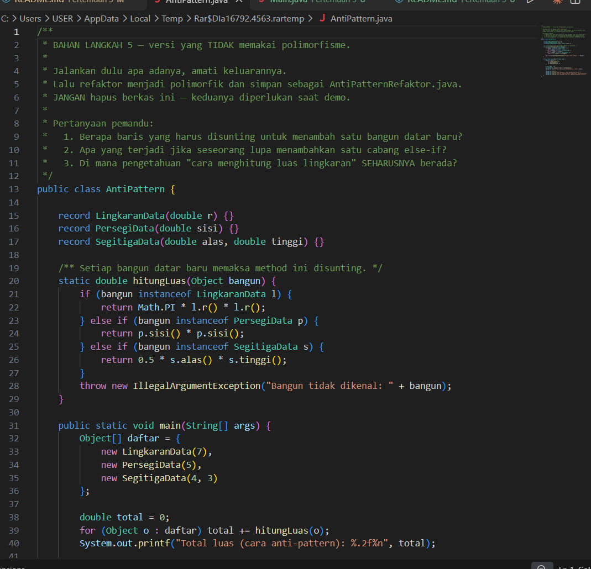

* **After** *(Kondisi akhir / Eksekusi berhasil)*:

### 1.2. File: `BangunDatar.java`

**Bukti Eksekusi (Screenshot):**
* **Before** *(Kondisi awal / Kesalahan kompilasi)*:
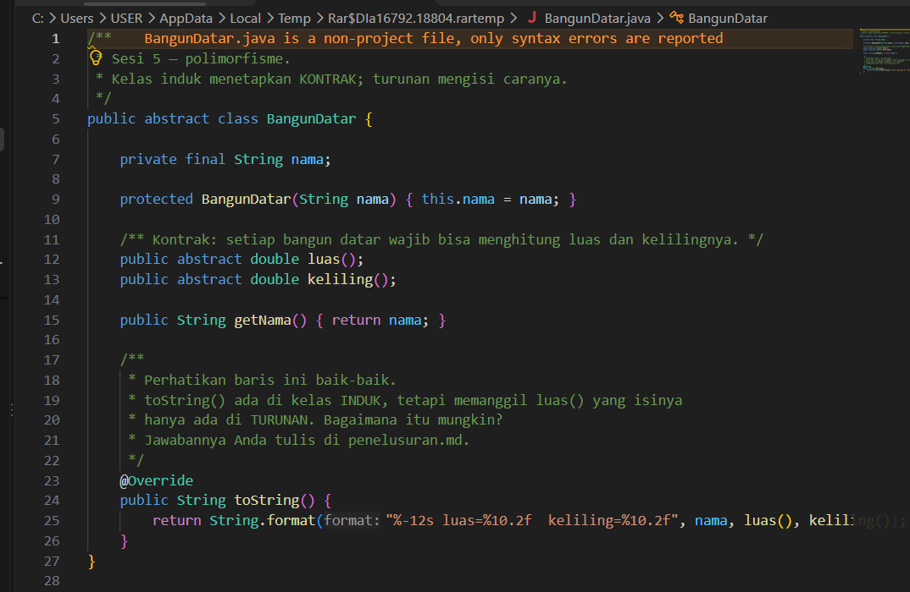

* **After** *(Kondisi akhir / Eksekusi berhasil)*:
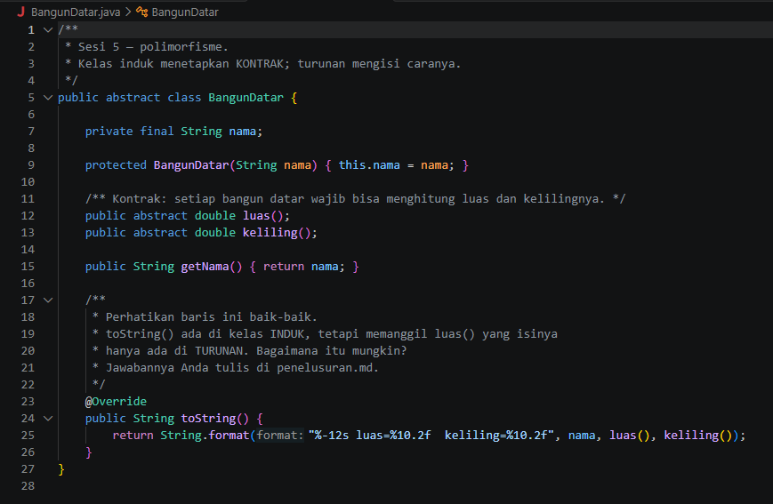    

### 1.3. File: `Main.java`

**Bukti Eksekusi (Screenshot):**
* **Before** *(Kondisi awal / Kesalahan kompilasi)*:
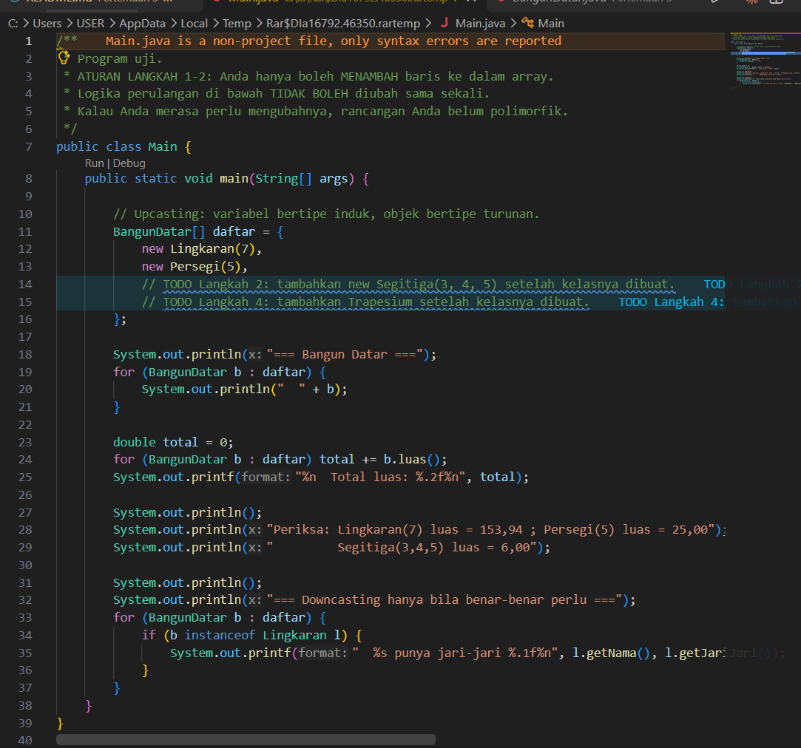    
* **After** *(Kondisi akhir / Eksekusi berhasil)*:
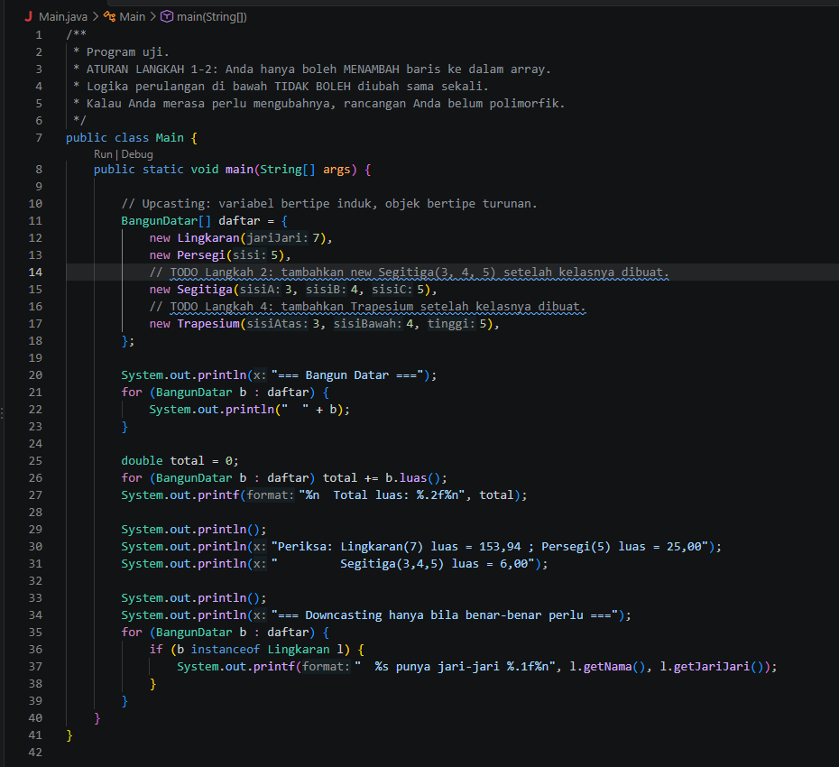

### 1.4. File: `Lingkaran.java`

**Bukti Eksekusi (Screenshot):**
* **Before** *(Kondisi awal / Kesalahan kompilasi)*:
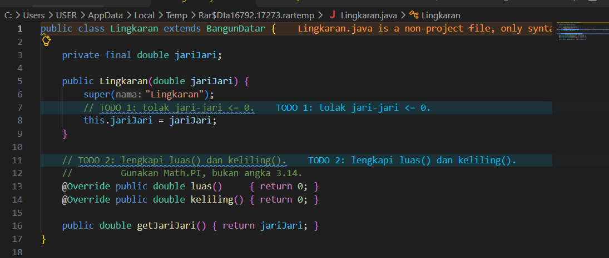  
* **After** *(Kondisi akhir / Eksekusi berhasil)*:
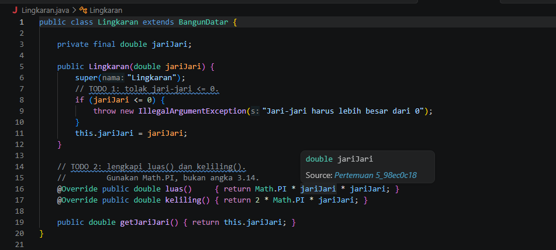  

### 1.5. File: `Persegi.java`

**Bukti Eksekusi (Screenshot):**
* **Before** *(Kondisi awal / Kesalahan kompilasi)*:
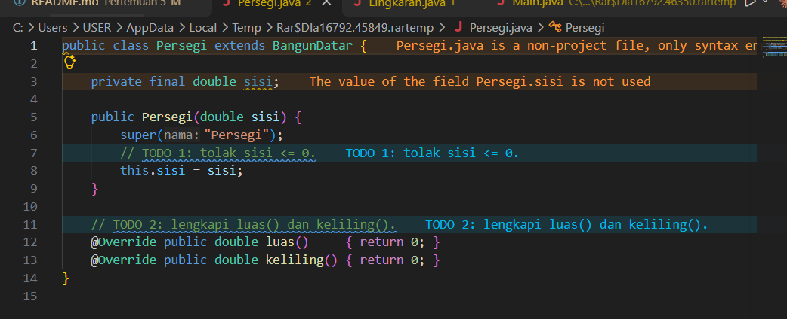
* **After** *(Kondisi akhir / Eksekusi berhasil)*:
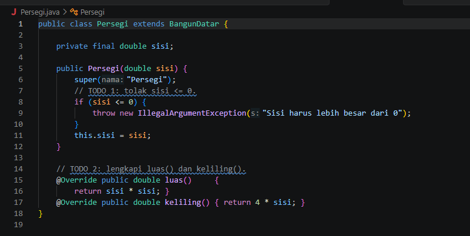  

### 1.6. File: `Trapesium.java`
**Penjelasan Kode:**
> Penambahan kelas Trapesium ke dalam hierarki bangun datar bertujuan untuk memperluas cakupan pemodelan geometri agar sistem mampu menangani bentuk bangun datar tidak beraturan yang memiliki dua sisi sejajar dengan panjang berbeda dan tinggi tertentu. Melalui pewarisan dari kelas abstrak induk, Trapesium dapat mengintegrasikan mekanisme validasi ukuran dan penggunaan atribut imutabel dengan konsisten, sekaligus mengimplementasikan kalkulasi luas serta keliling spesifiknya sendiri melalui mekanisme method overriding. Hal ini membuktikan fleksibilitas struktur polimorfisme program, di mana jenis bentuk geometri baru dapat ditambahkan dengan mudah ke dalam larik pemrosesan utama tanpa harus merusak atau mengubah logika iterasi yang sudah ada.

* **Penambahan** *(Kondisi akhir / Eksekusi berhasil)*:
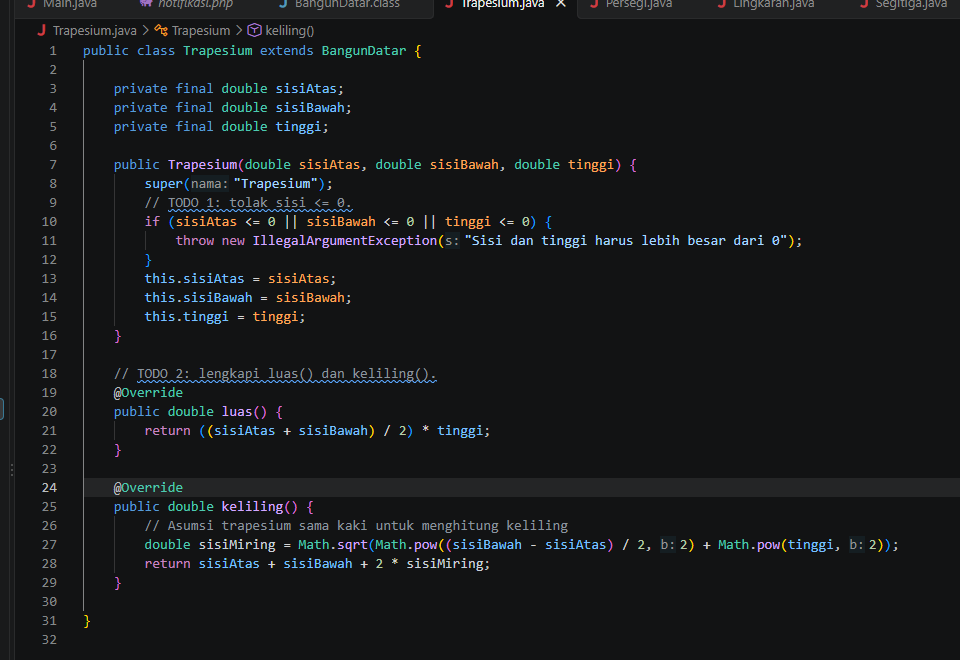      

### 1.7. File: `Segitiga.java`
**Penjelasan Kode:**
> Penambahan kelas `Segitiga` ke dalam hierarki bangun datar bertujuan untuk memperluas kemampuan sistem dalam memodelkan bentuk geometri bersisi tiga yang memerlukan pendekatan matematis khusus, seperti penggunaan Rumus Heron dan perhitungan semi-perimeter untuk menentukan luas serta kelilingnya. Dengan mewarisi kelas abstrak induk, kelas ini memastikan setiap sisi yang dimasukkan wajib bernilai positif melalui validasi konstruktor yang ketat. Selain itu, kehadiran kelas `Segitiga` membuktikan fleksibilitas konsep polimorfisme, di mana objek baru dapat diintegrasikan secara mulus ke dalam larik pemrosesan utama tanpa harus mengubah struktur atau logika iterasi kode yang sudah ada.

* **Penambahan** *(Kondisi akhir / Eksekusi berhasil)*:
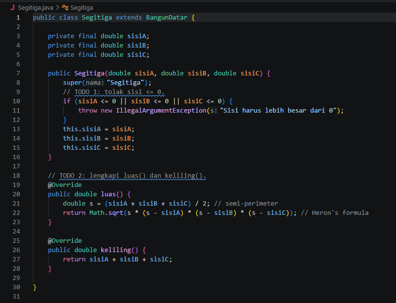    

### Output
**Output Program:**
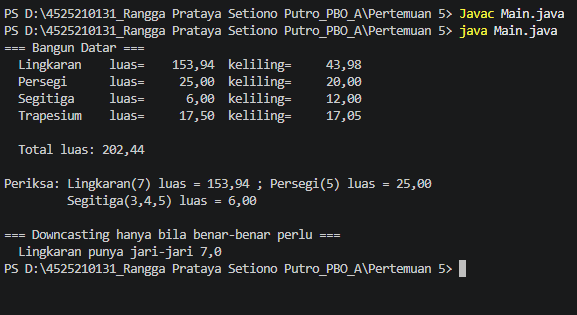  

---

## 2. Implementasi PHP
**Penjelasan Kode:**
> Kumpulan kode PHP di atas menerapkan konsep Pemrograman Berorientasi Objek (OOP) tingkat lanjut seperti kelas abstrak, pewarisan, dan polimorfisme untuk menyelesaikan dua kasus utama, yaitu pemodelan bangun datar geometri serta sistem pengiriman notifikasi terpusat. Pada implementasi bangun datar, kelas abstrak BangunDatar menyediakan fondasi properti serta method abstrak untuk perhitungan luas dan keliling yang kemudian diturunkan secara spesifik ke dalam kelas Lingkaran, Persegi, Segitiga, dan Trapesium. Setiap kelas turunan dilengkapi dengan validasi konstruktor yang ketat guna memastikan parameter ukuran bernilai valid, serta mengkalkulasi nilai geometris menggunakan fungsi matematika seperti Rumus Heron dan konstanta M_PI sebelum diproses secara seragam dalam larik menggunakan pemetaan fungsi. Sementara itu, pada implementasi sistem notifikasi, kelas abstrak Notifikasi bersama kelas-kelas turunannya (Email, SMS, WhatsApp) mendemonstrasikan bagaimana fungsi global kirimSemua() dapat mengeksekusi pengiriman pesan secara dinamis ke berbagai saluran komunikasi yang berbeda tanpa memerlukan satu pun pemeriksaan tipe data (type-checking) atau percabangan kondisi, sehingga struktur kode menjadi jauh lebih fleksibel, bersih, dan mudah dikembangkan.

### 2.1. File: `BangunDatar.php`

**Bukti Eksekusi (Screenshot):**
* **Before** *(Kondisi awal / Galat logika)*:
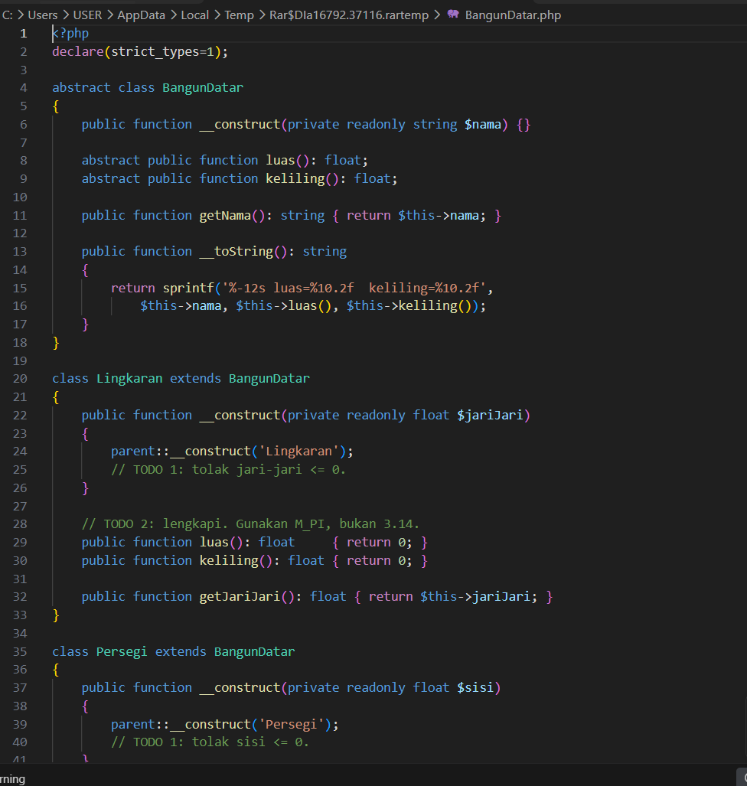

* **After** *(Kondisi akhir / Eksekusi berhasil)*:
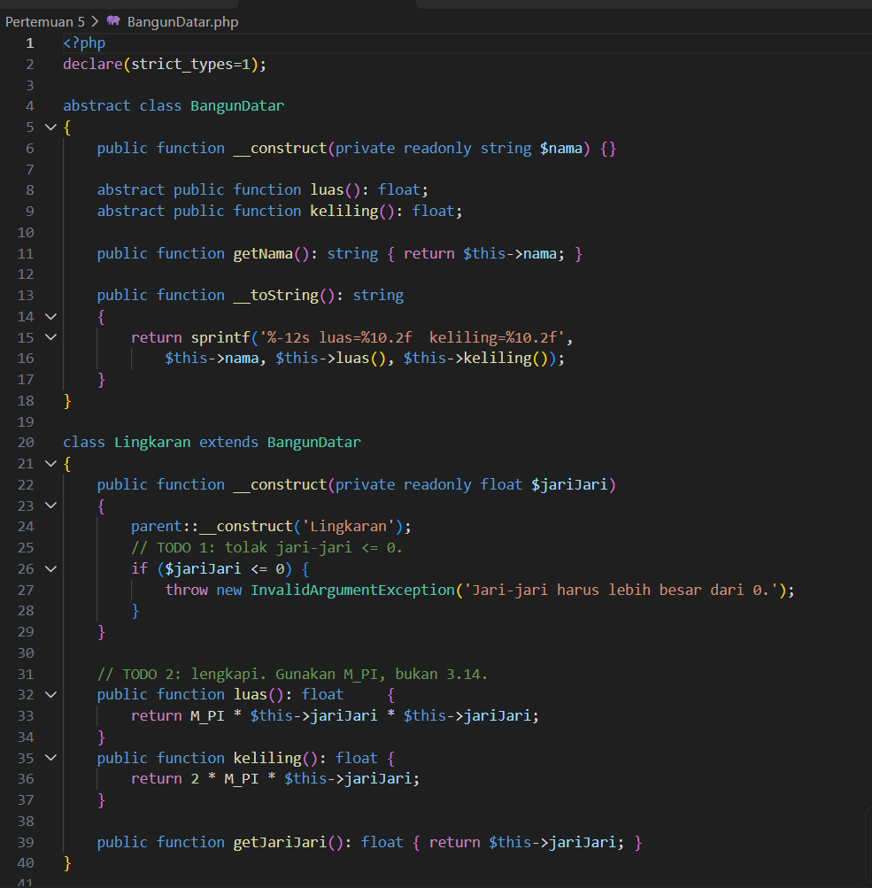

### 2.2. File: `Notifikasi.php`

**Bukti Eksekusi (Screenshot):**
* **Before** *(Kondisi awal / Galat logika)*:
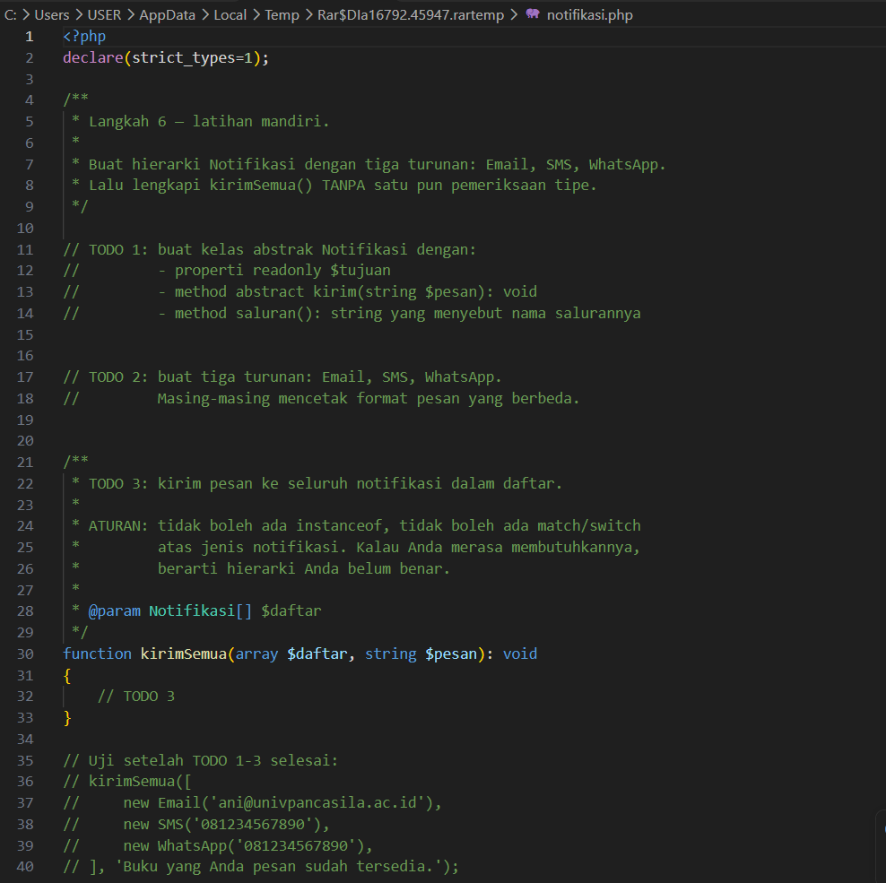

* **After** *(Kondisi akhir / Eksekusi berhasil)*:
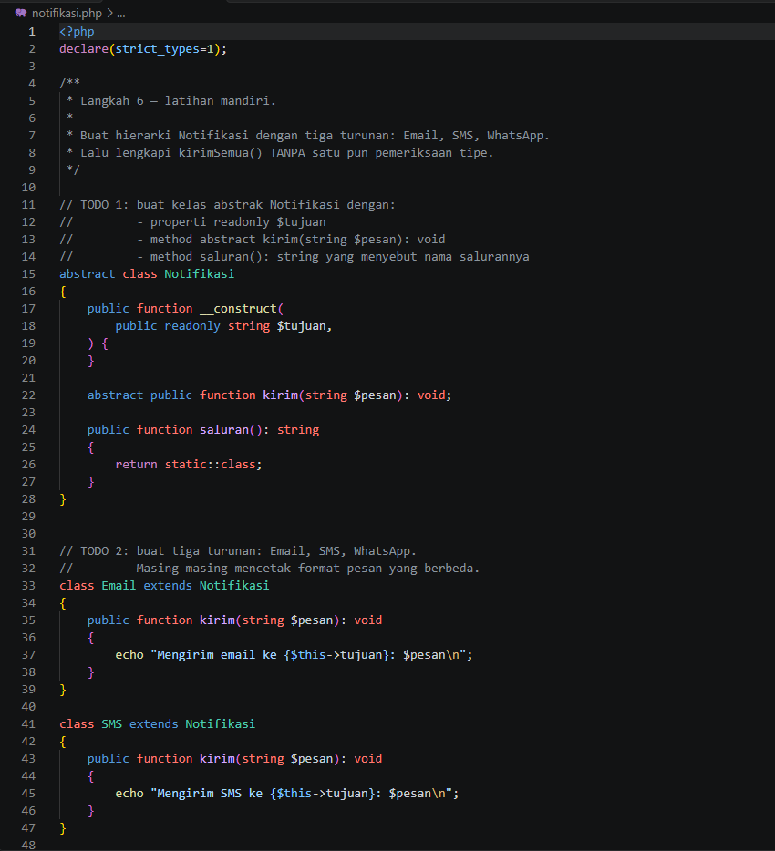

### 2.3. File: `main.php`

**Bukti Eksekusi (Screenshot):**
* **Before** *(Kondisi awal / Galat logika)*:
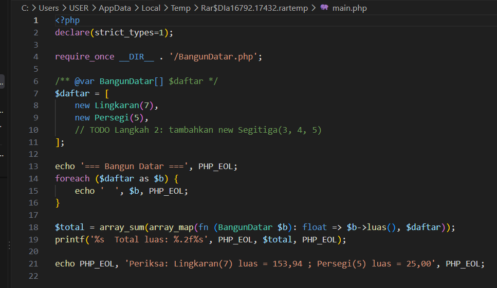

* **After** *(Kondisi akhir / Eksekusi berhasil)*:
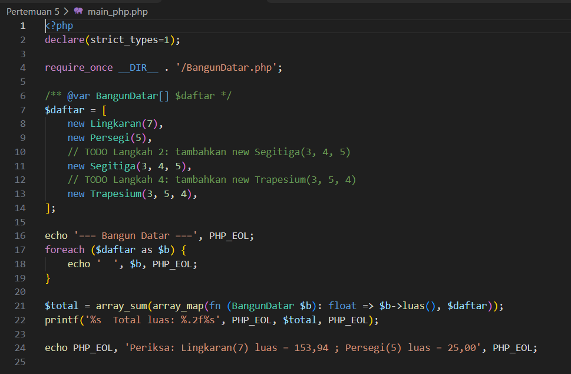

### Output
**Output Program:**

---

## 3. Kesimpulan
> Kesimpulan dari rangkaian program berbasis Java dan PHP yang telah dibahas adalah bahwa implementasi tersebut berhasil menerapkan konsep Pemrograman Berorientasi Objek (OOP) tingkat lanjut—khususnya penggunaan kelas abstrak, pewarisan (*inheritance*), enkapsulasi data melalui properti imutabel, validasi konstruktor yang ketat, serta polimorfisme. Melalui penerapan polimorfisme dan *method overriding*, program mampu mengelola serta memproses kumpulan objek yang beragam (seperti berbagai bentuk geometri bangun datar atau ragam saluran notifikasi) secara seragam dan dinamis di dalam larik (*array*) tanpa memerlukan percabangan kondisi atau pemeriksaan tipe data manual. Hal ini membuktikan bahwa struktur arsitektur kode yang dibangun menjadi sangat modular, bersih, aman dari data tidak valid, serta sangat fleksibel ketika harus diperluas atau ditambah komponen fungsionalitas barunya di masa mendatang.